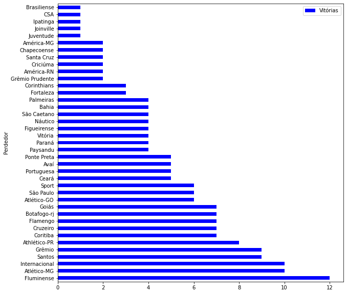
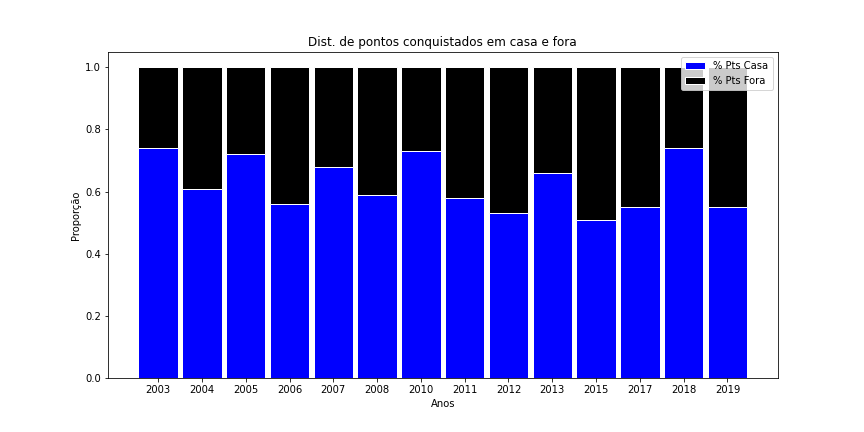
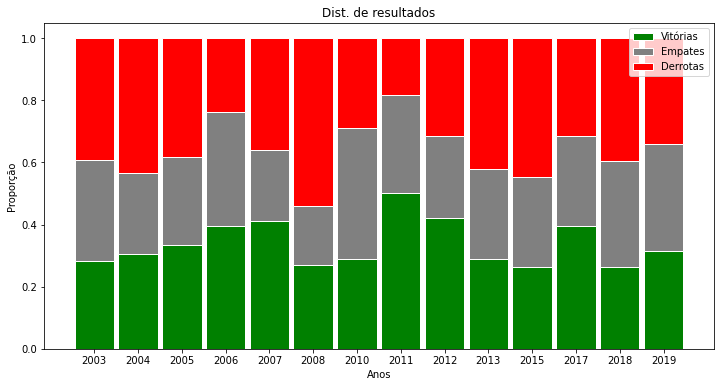
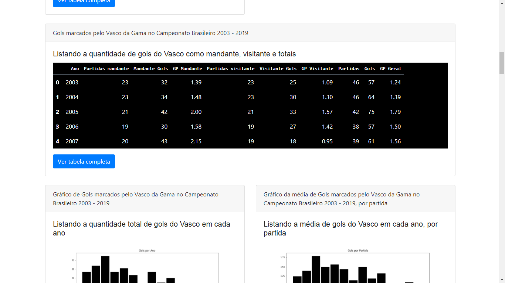
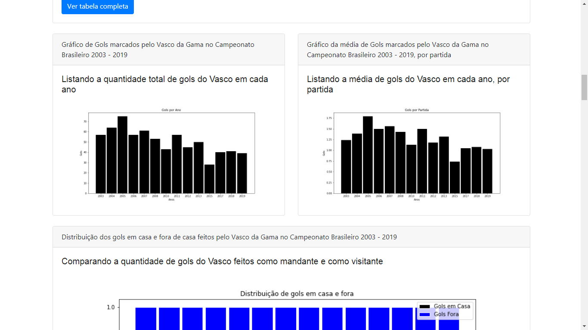
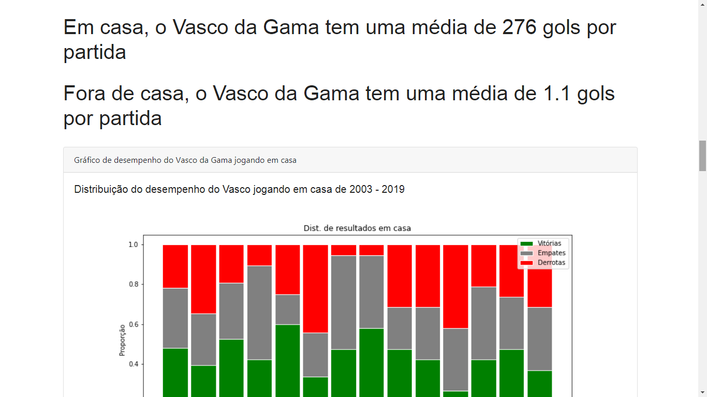
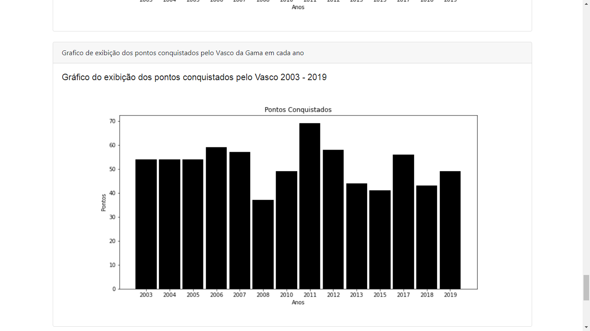

# Colab: Análise de Performace do Vasco da Gama no Campeonato Brasileiro de 2003 até 2019
Analisando o desempenho do Clube de Regatas Vasco da Gama no Campeonato Brasileiro a partir da modalidade de pontos corridos(2003) até 2019.
O arquivo .csv contém dados do Brasileirão do ano de 2000 até o ano de 2019.
A partir do csv é gerado um novo dataset contendo apenas os dados dos jogos do compeonato brasileiro no formato de pontos corridos (2003 - 2019)

# Veja no Colab :
Colab - Gráficos : https://colab.research.google.com/drive/1Np5qyu6TLpDmXZDVrcrlTlov0k9OI9cs?usp=sharing

Colab - Dashboard básico Bootstrap: https://colab.research.google.com/drive/1pvTj1x5dj2y31604A5hcUfHggyGveM1m?usp=sharing

# Alguns Gráficos

Times que mais perderam para o Vasco da Gama nos Campeonatos Brasileiros 2003 até 2019

  

Comparativo de pontos conquistados pelo Vasco da Gama dentro e fora de casa de 2003 até 2019

  

Gráficos de resultados dos jogos do Vasco da Gama de 2003 até 2019

  

                                                                                                                                           
# ScreenShots Dashboard Bootstrap

  

  

  

  

# Repositório Original do Dataset 

https://github.com/adaoduque/Brasileirao_Dataset
